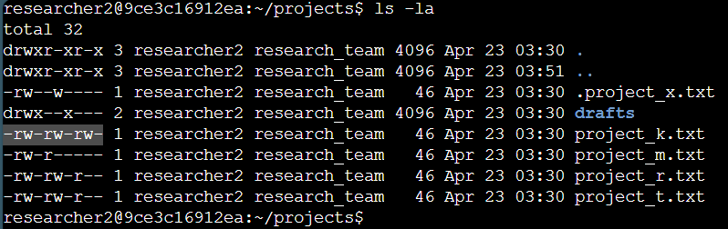
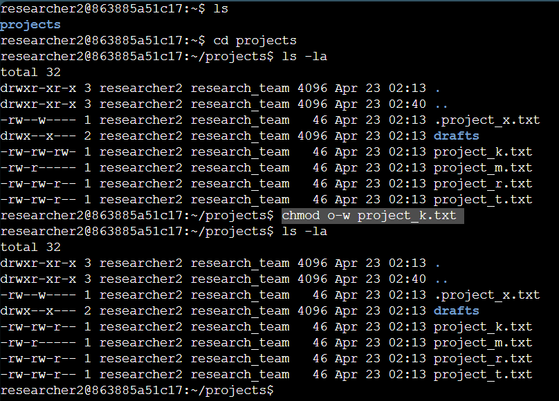
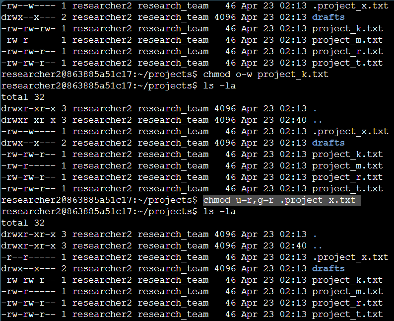
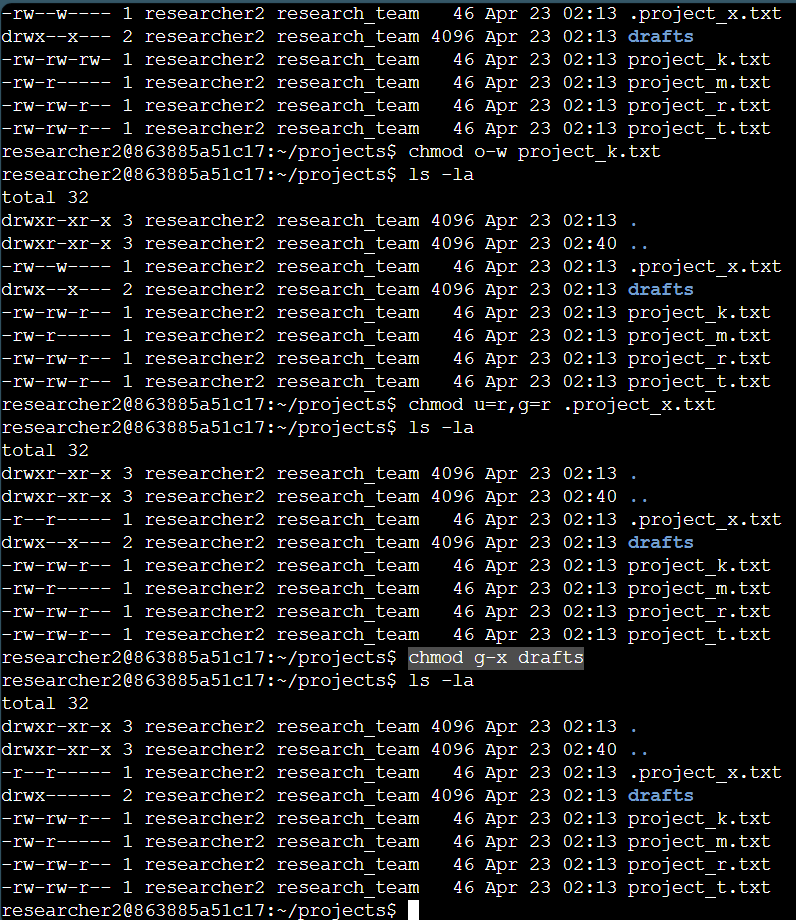

# File Permissions in Linux – Portfolio

## Project description

This project demonstrates my hands-on understanding of Linux file system permissions, a critical concept in securing systems from unauthorized access. As a security analyst, I simulated an auditing scenario where I reviewed and modified file and directory permissions to ensure that only authorized users on the research team had appropriate access. The project focused on identifying misconfigurations and applying role-based access control principles.

---

## Objectives

- Audit file and directory permissions using ls -la
- Interpret Linux permission strings
- Modify permissions with chmod to match organizational policy
- Secure hidden files and restrict unauthorized access to sensitive directories

---

## Toools and Commands used

- OS: Linux
- Commands: `ls`, `-la`, `chmod`

---

## Check file and directory details

Used the following command to list files, permissions, and hidden files:

- `ls -la`

This displayed ownership, permissions, and visibility status of files within the project directory..

  
Output of `ls -la` command

---

## Describe the permissions string

Each file or directory in Linux has a 10-character permission string. Here's an example breakdown for project_k.txt:

- The first character: - = file, d = directory
- Characters 2–4: user permissions (r = read, w = write, x = execute)
- Characters 5–7: group permissions
- Characters 8–10: others (everyone else)

  
Example of permission string breakdown

---

## Change file permissions

The file projects_k.txt mistakenly granted write permissions to others. I corrected it using:

- `chmod o-w project_k.txt`

  
Removing write permissions for others using chmod

---

## Change file permissions on a hidden file

The hidden file .project_x.txt was found to allow write access. It should only allow read access for the user and group. I corrected this using:

- `chmod u=r,g=r .project_x.txt`

  
Changing permissions on a hidden file

---

## Change directory permissions

Only Researcher 2 should have access to the drafts/ directory. To remove execute permissions from the group:

- `chmod g-x drafts`

  
Restricting directory access using chmod

  

---

## Summary

This project showcases my ability to:

- Analyze and interpret Linux file and directory permissions
- Apply access control principles via CLI
- Harden systems by enforcing the principle of least privilege
- Understanding and modifying file permissions is essential in system administration, IT support, and security operations. This lab strengthened my command-line confidence and security mindset.

---

*[Visit My GitHub Landing Page](https://github.com/Jovaan-Whitton)*
